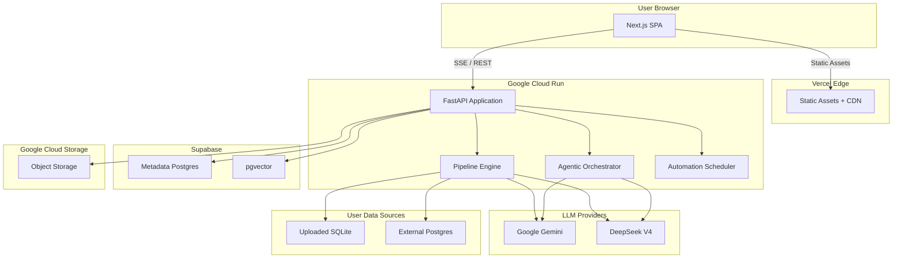

# InsightXpert.ai -- Architecture Overview

A high-level technical overview of the system architecture, component relationships, and key design decisions.

---

## System Diagram



---

## Backend Architecture

### Application Framework

The backend is a single FastAPI process running on Google Cloud Run. The app is constructed via `create_app()` which:

1. Reads settings from environment variables via a pydantic-settings `Settings` model (LRU-cached).
2. Initializes Sentry error tracking (no-ops when `SENTRY_DSN` is empty or pytest is running).
3. Constructs `FastAPI()` with an `async def lifespan` context manager.
4. Registers middleware: CORS -> GZip -> Audit.
5. Mounts ~28 routers under `/api/v1/`.

### Lifespan (Startup)

1. Settings loaded (hits LRU cache).
2. structlog logging configured (ConsoleRenderer for local; JSONRenderer for staging/prod).
3. Alembic migrations run to `head` via `asyncio.to_thread`.
4. Bootstrap users: idempotent creation of admin and optional test user.
5. Audit queue starts.
6. Automation scheduler starts (conditional on `AUTOMATIONS_ENABLED`).
7. SSE idle reaper launched as background `asyncio.Task`.
8. Server yields, ready to serve requests.

### Lifespan (Shutdown)

1. SSE reaper cancelled.
2. Audit queue stopped.
3. Scheduler stopped.
4. Cleanup logged.

### Router Registration

28 routers mounted in dependency order. Key routes:

| Router | Prefix | Purpose |
|---|---|---|
| `health` | `/api/v1/health` | Health check |
| `auth` | `/api/v1/auth/*` | Login, logout, register, me |
| `chat` | `/api/v1/chat*` | Chat (SSE), poll, answer, route |
| `databases` | `/api/v1/databases/*` | Database registry CRUD |
| `connections` | `/api/v1/connections/*` | BYO DB connection management |
| `sql` | `/api/v1/sql/*` | Direct SQL execution |
| `conversations` | `/api/v1/conversations/*` | Conversation CRUD + search |
| `feedback` | `/api/v1/feedback` | Message feedback |
| `client_config` | `/api/v1/client-config` | Client feature flags |
| `admin/*` | `/api/v1/admin/*` | Admin: users, overview, audit, metrics, prompts, RAG, databases |
| `shared_snapshots` | `/api/v1/shares/*` | Capability-token sharing |
| `automations` | `/api/v1/automations/*` | Automation CRUD (conditional) |
| `notifications` | `/api/v1/notifications/*` | Notification management (conditional) |
| `metrics` | `/metrics` | Prometheus metrics endpoint |

---

## Frontend Architecture

### Framework

Next.js 15 (App Router) with React 19, TypeScript, Tailwind CSS 4, shadcn/ui (New York style).

### State Management (7 Zustand Stores)

| Store | Responsibility |
|---|---|
| `auth-store` | User session (login, logout, register) |
| `chat-store` | Conversations, streaming state, agent steps, sidebar state |
| `settings-store` | Provider/model selection, agent mode |
| `client-config-store` | Per-org feature flags and branding |
| `insight-store` | Bookmarked insights, gallery |
| `automation-store` | Automation CRUD, workflow builder DAG |
| `notification-store` | Notifications, unread counts |

### SSE Client

The `use-sse-chat` hook manages the full streaming lifecycle:
1. Creates/reuses a conversation.
2. Opens a `POST` request to `/api/v1/chat` (SSE with request body).
3. Parses newline-delimited JSON chunks via `sse-client.ts` with microtask batching.
4. Updates Zustand stores in real-time for each chunk type.
5. Manages agent step timeline (pending -> running -> done/error).
6. Handles AbortController for stop functionality.

### Chunk Rendering

The `ChunkRenderer` component dispatches each chunk type to a dedicated React component:

| Chunk Type | Component | Renders |
|---|---|---|
| `status` | StatusChunk | Progress indicator |
| `sql_generated` | SqlChunk | Syntax-highlighted SQL with copy button |
| `rows_returned` | ToolResultChunk | Data table + auto-detected chart |
| `answer_delta` | AnswerChunk | Streaming markdown via react-markdown |
| `tool_call` | ToolCallChunk | Tool execution indicator |
| `error` | ErrorChunk | Error card |
| `metrics` | (internal) | Token counts and latency |
| `insight` | InsightChunk | Enriched insight with citations |
| `enrichment_trace` | ThinkingTrace | Collapsible enrichment trace |
| `orchestrator_plan` | ThinkingTrace | DAG plan visualization |

---

## Database Architecture

### Two-Engine Pool Pattern

The application uses two independent SQLAlchemy engine singletons to isolate request-serving work from background work:

| Engine | Pool Size | Overflow | Timeout | Used By |
|---|---|---|---|---|
| Request (`get_request_engine()`) | 15 | 10 | 10s | All HTTP route handlers |
| Background (`get_background_engine()`) | 2 | 0 | 30s | Automation scheduler/runner |

Both engines are lazily created on first access. A `reset_engine_cache()` test hook disposes both.

### Metadata DB (Supabase Postgres)

- Stores users, conversations, databases registry, audit logs, automations, profiles, insights, shared snapshots, notifications.
- Managed by SQLAlchemy Core (not ORM) with Alembic migrations (13+ migrations).
- `pgvector` extension for RAG embeddings (cosine distance via `<=>` operator).
- Configured for pgbouncer transaction pooling (`pool_pre_ping=False`, `prepare_threshold=None`).
- Alembic uses a direct (non-pooler) connection URL for DDL operations.

### User DBs (SQLite / External Postgres)

- Accessed via `DatabaseConnector` (`db/connector.py`) with dual read-only enforcement.
- **Write protection** is belt-and-suspenders:
  1. `FORBIDDEN_SQL_RE` regex blocks INSERT/UPDATE/DELETE/DROP/ALTER/CREATE/TRUNCATE/REPLACE/MERGE/GRANT/REVOKE/ATTACH/DETACH.
  2. `PRAGMA query_only = ON` before every query, reset in `finally`.
- Multi-backend dispatch via `resolve_connector()` routes by `kind` -> `sqlite_file` / `postgres`.
- Row limit enforced: default 1,000 rows; timeout: 30s.
- External Postgres credentials encrypted at rest with Fernet (`cryptography` library).

### BYO Database Connections

The `connections/` module supports external PostgreSQL connections:
- `PostgresConnection` type with `to_dsn()` builder, `ssl_mode`, `schema` pinning.
- Read-only enforcement: regex blocklist + `default_transaction_read_only=on`.
- `statement_timeout` and `search_path` set per connection.
- Credential redaction in repr/logs via `_RedactingMixin`.

---

## Pipeline Architecture

The 8-stage pipeline is the core of the text-to-SQL system. Stages run sequentially; each reads from and writes to a shared `PipelineContext`.

```
ProfilerStage -> SchemaLinkerStage | FullSchemaStage -> SqlGeneratorStage
-> SqlValidatorStage -> SqlExecutorStage -> SqlRefinerStage
-> AnswerSynthesizerStage
```

### Stage 1: ProfilerStage

Loads or generates a `DatabaseProfile` with schema, column statistics, and optional LLM-generated summaries/quirks. Uses batched LLM calls (default 20 columns per batch). Results cached in Postgres with process-level LRU memo.

### Stage 2: SchemaLinkerStage

Trial-SQL-based schema linking in 6 sub-steps:
1. Trial SQL generation (LLM with full schema).
2. Field extraction (table/column references from candidates).
3. LSH literal matching (string literals -> column values).
4. Semantic top-k (vector index cosine similarity, if available).
5. Join path expansion (follows declared foreign keys).
6. Final render: compact schema text for the SQL generator.

Alternative: `FullSchemaStage` bypasses all linker logic, rendering complete schema with FK tags.

### Stage 3: SqlGeneratorStage

Renders `sql_generation.j2` (163-line production prompt with CoT, JOIN guidance, rule includes). Supports conditional few-shot injection from pre-fetched BIRD-train examples.

### Stage 4: SqlValidatorStage

Validates SQL via `sqlglot.parse_one(sql, dialect="sqlite")`. On failure, sets `ctx.state["error"]` (does not raise).

### Stage 5: SqlExecutorStage

Executes SQL against the user database with dual read-only enforcement. Skips if error flag is set from validator.

### Stage 6: SqlRefinerStage

Iterative error recovery (up to 2 iterations): renders `refine_sql.j2` -> LLM call -> inline validate -> inline execute. Clears error on success, leaves it on persistent failure.

### Stage 7: AnswerSynthesizerStage

Renders `answer_synthesizer.j2` with question, DDL, SQL, columns, and rows. **Streaming path**: emits incremental `answer_delta` chunks as the LLM generates, so the frontend renders materializing text live.

### Preflight Parallelism

Three independent operations run concurrently via `asyncio.TaskGroup` before the pipeline:
- Profile prefetch (DB I/O)
- Mode classification (LLM call for `agent_mode="auto"`)
- Few-shot example retrieval (embedding + cosine similarity)

### Error-as-Flag Pattern

The validator and executor do not raise exceptions. They write `ctx.state["error"]` as a sentinel string. This allows the refiner to attempt recovery without aborting the entire pipeline.

---

## Agentic Orchestration

When `agent_mode ∈ {"basic", "agentic"}`, the route wraps the pipeline as an `analyst_loop` adapter and passes it to the vendored `orchestrator_loop()`.

### Modes

| Mode | Pipeline | LLM Calls | Output |
|---|---|---|---|
| `basic` | Single `analyst_loop()` | 1-3 | Raw answer |
| `agentic` | analyst -> evaluate -> DAG enrich -> synthesize -> quality gate | 4-7+ | Cited insight with source refs |

### Orchestrator Flow

1. **Analyst**: Answers the question immediately (user sees results streaming).
2. **Enrichment Evaluator**: LLM scores the analyst's answer, decides which enrichment categories are worthwhile: `comparative_context`, `temporal_trend`, `root_cause`, `segmentation`.
3. **DAG Executor**: Runs approved sub-agents in parallel (respecting declared dependencies). Each sub-agent is either a `sql_analyst` (another SQL query loop) or a `quant_analyst` (Python-based statistical analysis).
4. **Response Synthesizer**: Merges all sub-results into a single cited insight. Citations use `[^N]` footnote format.
5. **Quality Gate**: Validates the synthesized insight before persistence.

### Auto Mode

When `agent_mode="auto"`, a lightweight LLM call (`gemini-3.1-flash-lite-preview` with `mode_router.j2`) classifies the question as `"basic"` or `"agentic"`. The server also re-classifies `"auto"` as defense-in-depth, even when the frontend pre-routes via `POST /chat/route`.

---

## Infrastructure

| Component | Provider | Details |
|---|---|---|
| **Frontend Hosting** | Vercel | Next.js with edge CDN and SSR support |
| **Backend Hosting** | Google Cloud Run | Serverless containers, auto-scaling |
| **Metadata DB** | Supabase | Managed Postgres with pgvector, pgbouncer |
| **Object Storage** | Google Cloud Storage | User uploads, import/export |
| **Monitoring** | Sentry | Error tracking (no-ops locally) |
| **Metrics** | Prometheus | In-memory counters, `/metrics` endpoint |
| **Logging** | structlog | ConsoleRenderer (local), JSONRenderer (prod) |
| **CI/CD** | Manual | See docs/decisions/D-045 |

---

## Key Design Decisions

This is a summary. Full records with rationale, alternatives considered, and tradeoffs are in `docs/decisions/`.

| Decision | Document | Summary |
|---|---|---|
| Python + FastAPI on Cloud Run | D-001 | Async web framework, serverless containers |
| Turborepo monorepo | D-002 | apps/web + apps/api + packages/types |
| Stage Protocol | D-004 | Structural subtyping for swappable pipeline stages |
| SSE streaming + chunk taxonomy | D-005, D-022 | Typed envelope, tiered structure |
| DialectAdapter strategy | D-006 | Protocol + registry, one file per dialect |
| Provider-agnostic LLM factory | D-007 | create_chat_llm(settings) |
| Repository/Service split | D-030 | table.py -> repository.py -> service.py |
| Protocol-based adapters | D-031 | Structural subtyping over ABC inheritance |
| SQLAlchemy Core, not ORM | D-013 | Performance, explicit SQL control |
| Two-engine pool isolation | D-060 | Request vs. background engines |
| itsdangerous session cookies | D-050 | No server-side session store |
| Argon2id password hashing | D-051 | Modern, memory-hard algorithm |
| Fernet credential encryption | D-052 | Symmetric encryption for BYO DB creds |
| Dual read-only SQL enforcement | D-053 | Regex + PRAGMA query_only |
| Alembic naming convention | D-015 | Consistent constraint names |
| pgvector for RAG | D-014 | Cosine distance, per-DB scoping |
| Vercel frontend hosting | D-042 | Edge CDN, Next.js native |
| In-process caches (30s TTL) | D-065 | Profile cache, auth cache, admin overview cache |
| Audit with back-pressure | D-073 | Batched queue, oldest-drop overflow |
| asyncio.to_thread | D-034 | Non-blocking sync DB calls |
| `api/v1` prefix | D-020 | Versioned API surface |

---

## Directory Structure

```
InsightXpert.ai/
├── apps/
│   ├── api/                      # Python FastAPI backend
│   │   ├── pyproject.toml
│   │   ├── alembic/              # Database migrations
│   │   ├── src/insightxpert_api/
│   │   │   ├── main.py           # App factory + lifespan
│   │   │   ├── config.py         # Pydantic Settings
│   │   │   ├── routes/           # 27 route modules
│   │   │   ├── pipeline/         # 7 pipeline stages + core
│   │   │   ├── agents/           # Analyst + orchestrator adapter
│   │   │   ├── vendored/         # Vendored agents_core + pipeline_core
│   │   │   ├── llm/              # Gemini + DeepSeek providers
│   │   │   ├── db/               # Engine, connector, schema
│   │   │   ├── auth/             # Session signer, current user dep
│   │   │   ├── users/            # User lifecycle (repo/service split)
│   │   │   ├── automations/      # Scheduler, runner, triggers
│   │   │   ├── profiling/        # Batched profiling + LLM summaries
│   │   │   ├── sse/              # EventEmitter + chunk types
│   │   │   ├── services/         # Conversation store, notification emitters
│   │   │   ├── rag/              # pgvector store
│   │   │   ├── prompts/          # Prompt resolver + admin
│   │   │   ├── shared_snapshots/ # Capability-token sharing
│   │   │   ├── sample_questions/ # Per-DB question generation
│   │   │   ├── metrics/          # Query metrics + cost tracking
│   │   │   ├── audit/            # Async audit logging
│   │   │   ├── connections/      # BYO DB (encrypted Postgres creds)
│   │   │   ├── databases/        # Database registry
│   │   │   ├── storage/          # GCS + local FS object store
│   │   │   └── admin/            # Admin overview cache
│   │   └── tests/                # pytest + pytest-asyncio
│   │
│   └── web/                      # Next.js frontend
│       └── src/
│           ├── app/              # App Router (layout, pages, admin)
│           ├── components/
│           │   ├── chat/         # ChatPanel, MessageBubble, Input
│           │   ├── chunks/       # 15 chunk renderers
│           │   ├── layout/       # AppShell, Header, Sidebars
│           │   ├── sidebar/      # ConversationList, ProcessSteps
│           │   ├── insights/     # InsightBell, Popover, Gallery
│           │   ├── automations/  # WorkflowBuilder, Canvas, Cards
│           │   ├── notifications/# NotificationBell, Popover
│           │   ├── sql/          # SqlExecutor, ChartConfigurator
│           │   ├── admin/        # FeatureToggles, Branding, Users
│           │   └── ui/           # shadcn/Radix primitives
│           ├── hooks/            # 7 custom hooks
│           ├── stores/           # 7 Zustand stores
│           ├── lib/              # API client, SSE client, chart detector
│           └── types/            # TypeScript interfaces
│
├── packages/
│   └── types/                    # Shared TypeScript types
│
├── docs/
│   ├── backend/                  # Backend reference documentation
│   ├── decisions/                # 55+ architecture decision records
│   └── STATUS.md                 # Project history and current state
│
└── turbo.json                    # Turborepo configuration
```

For detailed in-file descriptions, see `WALKTHROUGH.md` for a user-facing tour and `DESIGN_PATTERNS.md` for the key technical patterns.
