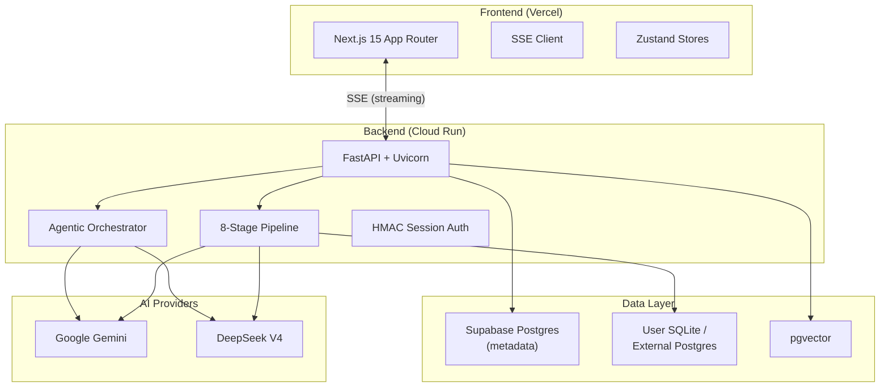

# InsightXpert.ai

**Ask your data anything. Get cited, verifiable answers -- no SQL required.**

---

## What Is This?

InsightXpert.ai is an AI-powered data analyst that lets you query your own databases using plain English. Upload a SQLite file, connect an external PostgreSQL database, or use a bundled sample -- then start asking questions.

Under the hood, natural language is translated to SQL through an 8-stage pipeline with full transparency. In **agentic mode**, a DAG-based multi-agent system automatically enriches answers with comparative context, temporal trends, root-cause hypotheses, and segmentation breakdowns.

---

## Key Features

| Category | Capabilities |
|---|---|
| **Plain-English Queries** | Ask any question about your data. The pipeline translates it to SQL, executes it, and synthesizes a cited answer. |
| **Multi-Dialect** | SQLite and PostgreSQL support via a `DialectAdapter` strategy pattern. Connect an external PG database or upload a SQLite file. |
| **Transparency Pipeline** | 8 stages stream real-time SSE chunks: profiling, schema linking, SQL generation, validation, execution, refinement, and answer synthesis. Every step is visible. |
| **Agentic Enrichment** | DAG-based multi-agent orchestration (analyst, quant analyst, enricher agents) automatically deepens answers with comparative context, temporal trends, root-cause analysis, and segmentation. |
| **BYO Database** | Connect your own PostgreSQL database with encrypted credentials (Fernet) or drag-and-drop a SQLite file. |
| **Profiling** | Automated schema profiling with batched LLM calls, join graph discovery, and LSH literal matching. |
| **Automations** | Scheduled insight generation with cron-based scheduling (APScheduler), trigger conditions, and notification dispatch. |
| **Sharing** | Capability-token-based conversation snapshots with configurable expiration. |
| **Insights** | Bookmarkable, per-user insights extracted from conversations, quality-gated before persistence. |
| **Sample Questions** | Per-database LLM-generated starter questions to help users explore their data. |

---

## Architecture at a Glance

---

## Tech Stack

| Layer | Technology |
|---|---|
| **Backend Language** | Python 3.12 |
| **API Framework** | FastAPI (async, SSE streaming, lifespan management) |
| **Frontend** | Next.js 15 (App Router), React 19, TypeScript |
| **State Management** | Zustand (7 stores) |
| **Styling** | Tailwind CSS 4, shadcn/ui (Radix primitives) |
| **Metadata DB** | Supabase Postgres (SQLAlchemy Core + Alembic) |
| **User DBs** | SQLite / external PostgreSQL (DialectAdapter) |
| **Vector Store** | pgvector (cosine distance via `<=>`) |
| **LLM (primary)** | Google Gemini (2.5 Flash, 3.1 Flash Lite, embedding-001) |
| **LLM (secondary)** | DeepSeek V4 (provider-agnostic factory) |
| **Auth** | HMAC-signed session cookies (itsdangerous), Argon2id hashing |
| **Backend Hosting** | Google Cloud Run (serverless containers) |
| **Frontend Hosting** | Vercel |
| **Object Storage** | Google Cloud Storage |
| **Package Management** | uv (Python), npm workspaces (Node) |
| **Monorepo** | Turborepo (apps/web + apps/api + packages/types) |
| **Observability** | structlog, Sentry, Prometheus metrics |
| **Testing** | pytest + pytest-asyncio (~280+ tests) |

---

## Quick Links

| Document | Description |
|---|---|
| [ARCHITECTURE.md](./ARCHITECTURE.md) | High-level architecture overview with diagrams |
| [WALKTHROUGH.md](./WALKTHROUGH.md) | Practical walkthrough: getting started, profiling, agentic mode, sharing |
| [DESIGN_PATTERNS.md](./DESIGN_PATTERNS.md) | Key design patterns: Stage Protocol, DialectAdapter, SSE taxonomy, two-engine pool |
| [docs/backend/](../docs/backend/) | Backend reference: architecture, API routes, pipeline, vendored code, services |
| [docs/decisions/](../docs/decisions/) | 55+ architecture decision records with rationale and tradeoffs |

---

## License

MIT -- see [LICENSE](./LICENSE).

Copyright (c) 2025-2026 Nachiket Kandari.
